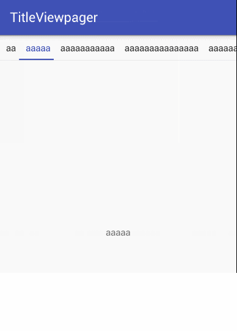

# TitleViewpager
一个简单易用，能自定义，带title的viewpager

**效果**

**模式**

            FIT,//适应宽度,会根据宽度平分
            FIX,//固定宽度，可以设置固定的宽度
            WRAPPER;//自适用内容，根据title文字内容的宽度决定

 **实现**

 1. Add it in your root build.gradle at the end of repositories:

    	allprojects {
    		repositories {
    			...
    			maven { url 'https://jitpack.io' }
    		}
    	}

 2. Add the dependency:

        dependencies {
       	        compile 'com.github.codbking:TitleViewpager:v1.0.1'
       	}

 ***xml***

         <com.codbking.titleviewpager.view.TitleViewPager
             android:id="@+id/pager"
             android:layout_width="match_parent"
             android:layout_height="0dp"
             android:layout_weight="1"
             app:tvp_pager_type="WRAPPER"
             app:tvp_indicatorColor="@color/main_color"
             app:tvp_indicatorHeight="2dp"
             app:tvp_titleWidth="100dp"
             />

 ***java***

                mPager.put("aa",MyFragment.newInstance("aa"));
                mPager.put("aaaaa",MyFragment.newInstance("aaaaa"));
                mPager.put("aaaaaaaaaaa",MyFragment.newInstance("aaaaaaaaaaa"));
                mPager.put("aaaaaaaaaaaaaaa",MyFragment.newInstance("aaaaaaaaaaaaaaa"));
                mPager.put("aaaaaaaaaaaaaaaaaaaa",MyFragment.newInstance("aaaaaaaaaaaaaaaaaaaa"));
                mPager.put("aaaaaaaaaaaaaaaaaaaaaaaa",MyFragment.newInstance("aaaaaaaaaaaaaaaaaaaaaaaa"));
                mPager.put("aaaaaaaaaaaaaaaaaaaaaaaaaaaa",MyFragment.newInstance("aaaaaaaaaaaaaaaaaaaaaaaaaaaa"));
                mPager.load();

