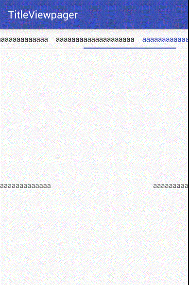

# TitleViewpager
一个简单易用，能自定义，带title的viewpager

**效果**

 **实现**

 ***xml***
<pre>
         <com.codbking.titleviewpager.view.TitleViewPager
             android:id="@+id/pager"
             android:layout_width="match_parent"
             android:layout_height="0dp"
             android:layout_weight="1"
             app:tvp_pager_type="WRAPPER"
             app:tvp_indicatorColor="@color/main_color"
             app:tvp_indicatorHeight="2dp"
             app:tvp_titleWidth="100dp"
             />
</pre>

 ***java***

<pre>
                mPager.put("aa",MyFragment.newInstance("aa"));
                mPager.put("aaaaa",MyFragment.newInstance("aaaaa"));
                mPager.put("aaaaaaaaaaa",MyFragment.newInstance("aaaaaaaaaaa"));
                mPager.put("aaaaaaaaaaaaaaa",MyFragment.newInstance("aaaaaaaaaaaaaaa"));
                mPager.put("aaaaaaaaaaaaaaaaaaaa",MyFragment.newInstance("aaaaaaaaaaaaaaaaaaaa"));
                mPager.put("aaaaaaaaaaaaaaaaaaaaaaaa",MyFragment.newInstance("aaaaaaaaaaaaaaaaaaaaaaaa"));
                mPager.put("aaaaaaaaaaaaaaaaaaaaaaaaaaaa",MyFragment.newInstance("aaaaaaaaaaaaaaaaaaaaaaaaaaaa"));
                mPager.load();
</pre>

